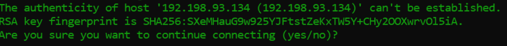
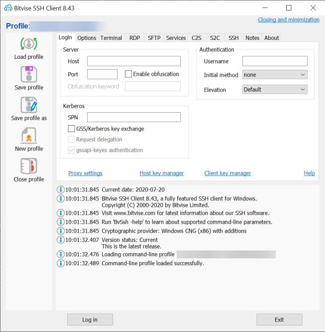
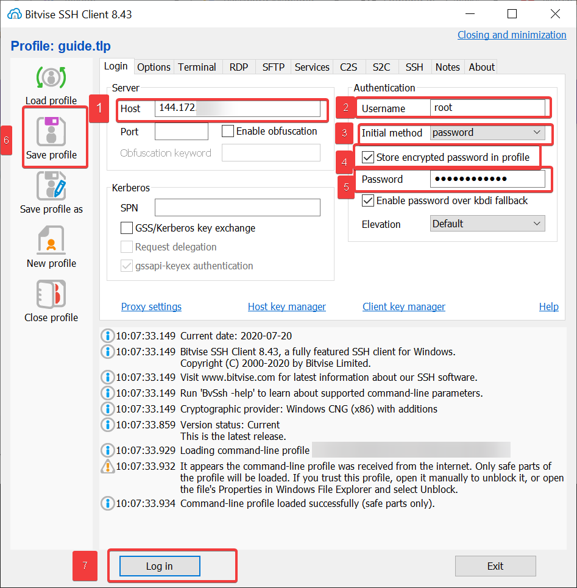
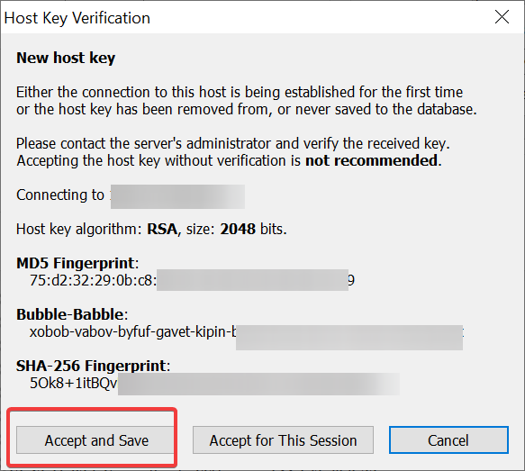
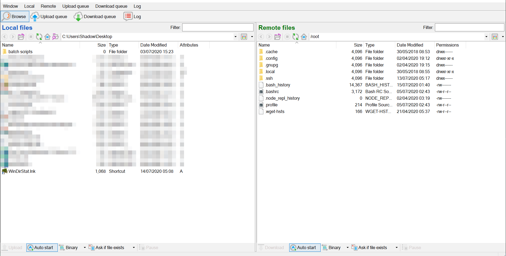

# How to login (Linux)
### Introduction
GalaxyGate servers can be managed by using an SSH client or SSH via terminal.To connect to your server, you'll need to open a terminal. How you do this varies between operating systems, but generally for the following operating systems:

* Linux: Search Terminal or press CTRL+ALT+T.
* macOS: Search Terminal.
* Windows Git bash: [Git for windows](https://gitforwindows.org/) comes with SSH.
* Windows SSH Client: You can download an SSH client like [Bitvise](https://www.bitvise.com/ssh-client-download).

## Using terminal 
Once the terminal is open, enter the following command. Make sure to substitute in your server's IP address after the `@` (`192.198.93.134`) should be your server's address.

```bash
ssh root@192.198.93.134
```

when you login the first time, the server isn't identified on your home machine, so you'll be asked if you're sure you want to continue connecting. You can type yes and then press ENTER key.



After clicking enter a host key fingerprint is saved to your local machine and you'll receive this confirmation:

```bash
Warning: Permanently added '192.198.93.134' (ECDSA) to the list of known hosts.
```

Asuming you don't have SSH keys added you will see this hopefully:

```bash
root@192.198.93.134's password:
```

When you enter your password, nothing is displayed in the terminal this is to prevent visual hacking, so it is suggested to paste in the initial password. Pasting into terminals is different on each platform:

* Linux: use CTRL+SHIFT+V.
* macOS: use SHIFT-CMD-V or the middle mouse button.
* Windows Bash: right-click on the window bar, choose Edit, then Paste. You can also right-click to paste if you enable QuickEdit mode.
* Windows CMD: If you are using CMD use Ctrl V.

Once you've entered the password, press ENTER.


### Remote Host has changed
You may happen to encounter this in your life:
This usually happens when you reinstall the OS and use the same IP, this just means that your local machine notices that the host key has changed and someone may be snooping in as the local machine expects the old host key.
If this happens, you can delete the old server's host key from your local system with the command ssh-keygen -R 192.198.93.134 and then reconnect.


## Using an SSH Client
Bitvise is a good SSH Client to use due to fact it has a built-in terminal along with a built-in SFTP client which is useful for transfering files without the use of git/CLI. You can find the download link of bitvise at the start of the guide ...

### Inputting the details
You will see an GUI like this when you first open Bitvise.



You will want to fill in the fields with the credentials you were given in the welcome email.


1. Enter your vps IP in the hostname field, this starts with 144.
1. Put `root` as the Username .
1. Click on the dropdown and select Password.
1. Make sure `Store encrypted password in profile` is ticked.
1. Type in the password, this was either emailed or set by you on purchase.
1. Hit save profile.
1. Hit Log in.

When you hit `Log in` and the correct details are entered you may notice this for the first time, just hit Accept and Save.


### How to use
* Highlight text to copy.
* Right click to paste.
* Ctrl C and Ctrl X can be used to exit certain screens.
* Commands typed here are executed on the VPS.


Bitvise's SFTP client is used to transfer files, a local and remote side is viewed, to transfer files just move them in somehwere remote/local area.
