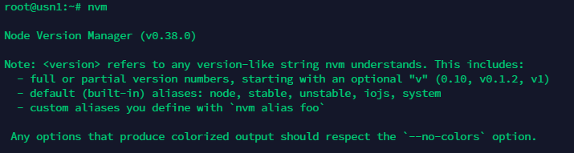
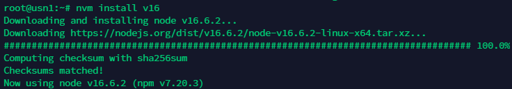

# Using Node Version Manager
### Introduction
Node Version Manager (nvm) is a version manager for node.js allowing you to choose what node version to use and install.



### Installing nvm
First of all, let's start by updating and upgrading everything.

You can update and upgrade everything by running the following:
```
apt-get update && apt-get upgrade && apt -y install wget
```
After that, Run the following to install:
```
wget -qO- https://raw.githubusercontent.com/nvm-sh/nvm/v0.38.0/install.sh | bash
```
After that finishes running, run the following:
```
export NVM_DIR="$([ -z "${XDG_CONFIG_HOME-}" ] && printf %s "${HOME}/.nvm" || printf %s "${XDG_CONFIG_HOME}/nvm")"
[ -s "$NVM_DIR/nvm.sh" ] && \. "$NVM_DIR/nvm.sh" # This loads nvm
```
This will load nvm and let you use it.
### Using nvm
In this example, we'll be installing Node v16.
To install, just run the following:
```
nvm install v16
```
Should look like this:


 
If for some reason it doesn't start using it automatically after installed, run this:
```
nvm use v16   
```
If the version isn't available it'll provide an error saying to install it.
That should conclude the install and how to use process.

Usage of nvm can be found [here](https://github.com/nvm-sh/nvm#usage).

### Resources
* [Git Repo](https://github.com/nvm-sh/nvm)