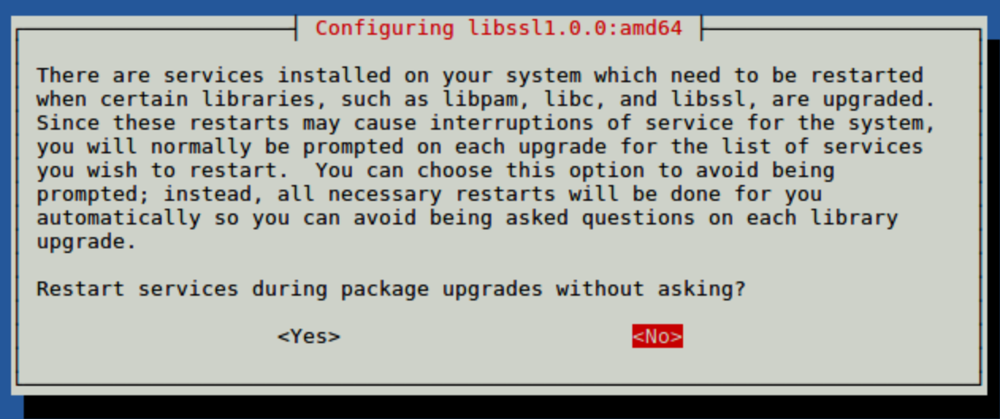
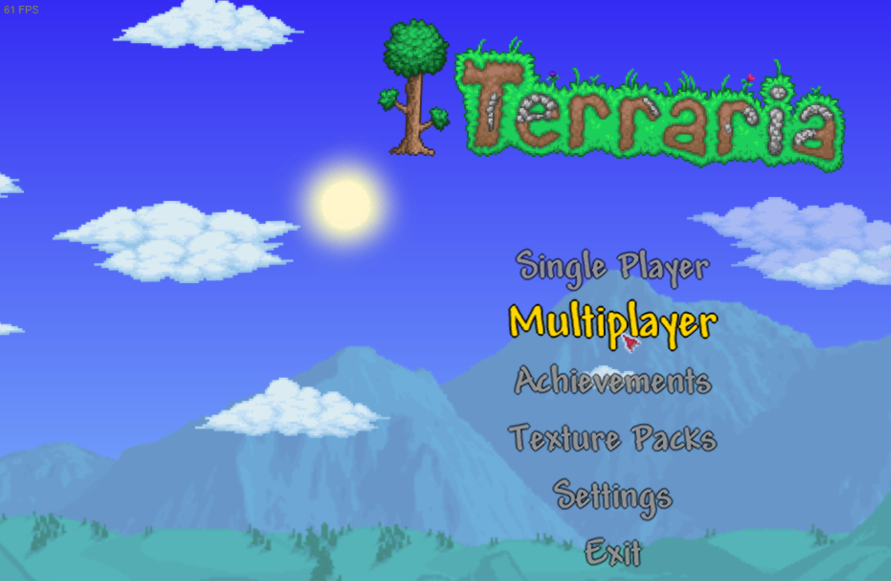
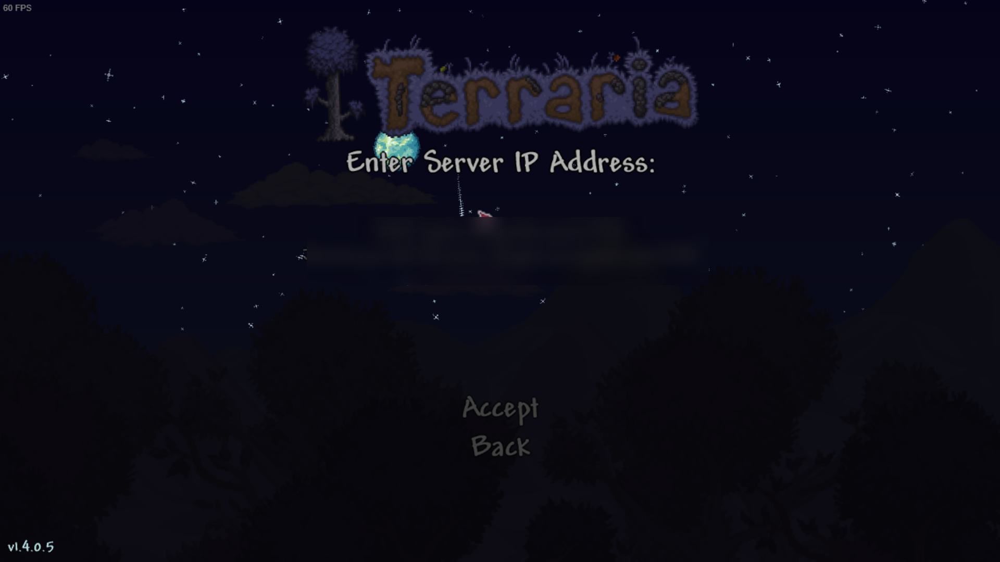

# Hosting a terraria server for PC
## Introduction
In this guide, you will be able to host a PC terraria server as well as keeping it alive without having to be logged in all the time. Before you start, make sure you meet the requirements and have a basic understanding of Linux, if you have issues or are stuck on a step you can ask for help in our [support server.](https://discord.gg/jcKEyxn)

*Don't feel like installing it by yourslf? Just run the command below as root to have it installed for* you!
```
curl -sSL https://scripts.proxied.cloud/terraria.sh | bash -
```


## Requirements 
* You have a Linux VPS (Debian/Ubuntu).
* You are logged in as root or have a user that can use sudo.
* You know how to establish an SSH connection or use an SSH client.
<br/>

*Don't know how to connect to your server? Check out this [guide](../../basics/first_login.md)*

## Installing required packages
I recommend that you should be logged in as root before executing these commands to ensure everything goes smoothly.

```
apt update && apt upgrade -y 
apt install sudo curl wget file unzip zip -y
```
!!! warning 
    You may get a popup like the one below, use the arrow key to click yes to proceed.

## Creating a user for terraria
For security purposes, terraria should not be running under the root user. We will create a new system user and group with home directory /opt/terraria that will run the terraria server:

```
useradd -r -m -U -d /opt/terraria -s /bin/bash terraria
```
We are not going to set a password for this user. This is a good security practice because this user will not be able to log in via SSH. To login to the terraria user, you’ll need to be logged in to the server as root or user with sudo privileges.

Before starting with the installation process, make sure you switch to the terraria user.

```
sudo su - terraria
```

## Creating the Directory 
If you plan to both versions of the server running I would recommend creating a folder for them to make sure the files do not conflict.
```
mkdir PC
cd PC
```


## Getting the server files
Please download one of the server Jars from below. Currently, 1.16 is the latest server jar.

1.4.0.5
```
wget https://www.terraria.org/system/dedicated_servers/archives/000/000/039/original/terraria-server-1405.zip -O server.zip
```
1.4.0.4
```
wget https://www.terraria.org/system/dedicated_servers/archives/000/000/038/original/terraria-server-1404.zip -O server.zip
```
1.4.0.3
```
wget https://terraria.org/system/dedicated_servers/archives/000/000/037/original/terraria-server-1403.zip -O server.zip
```
1.4.0.2
```
wget https://terraria.org/system/dedicated_servers/archives/000/000/036/original/terraria-server-1402.zip -O server.zip
```
1.3.5.3
```
wget http://terraria.org/server/terraria-server-1353.zip -O server.zip
```

!!! information
    Don't see the version you are looking for? you can grab the server files from this [website](https://terraria.gamepedia.com/Server#Downloads)

## Using the files
Please run the commands below:
```
unzip -q server.zip
cp -R 1*/Linux/* ./ 
chmod +x TerrariaServer.bin.x86_64 
rm -rf server.zip 
rm -rf version_number_downloaded_goes_here
chown -R terraria:terraria /opt/terraria

```

## Running the server
Run the command below to get started.
```
./TerrariaServer.bin.x86_64 
```
## Connecting to the server
You should grab the IP of your server which can be found using the command below if you do not know it.

```
dig +short myip.opendns.com @resolver1.opendns.com
```
!!! Note
    If the command above fails, try this command and copy the output as that is the IP of your server.

    ```curl icanhazip.com```
 Copy the IP and open terraria up, go to servers and click add a server and under `Server Address` put the server's IP in and click Done.

 
 

## Keeping your server alive
### Screen

Screen is one way of keeping your server running in the background without having to keep your SSH session open.

!!! warning
    `screen` does not boot on load or write logs to the disk automatically, reboots would kill the screen due to only being a virtual session.

To start your server with screen, first, make sure you have `screen` package installed.

#### Installation
You should've installed screen from the start of the guide. In the eventuality that you do not have `screen package` installed, please use the command below and make sure you're using root or sudo. You can install screen using the one-liner below:
```bash
sudo apt update && sudo apt install screen -y
```
!!! warning
    Make sure you are using root if you are still on the terraria account use `exit`, then execute the commands after you are done you should use the command listed to switch back to the terraria account `sudo su - terraria`.
#### Usage
You can then start your server by using the command below:
```bash
screen -S terraria -L 
./TerrariaServer.bin.x86_64 
```
This should create a session you can safely leave without fear of it shutting down when you leave, 
You can leave the screen via `CTRL+AD` from this session so your Server is still online when you leave.

You can re-attach to the running screen by running `screen -r terraria` and either issue commands or shutdown the server via `CTRL+C`.
## Resources
* [Terraria Wiki](https://terraria.gamepedia.com/Terraria_Wiki)<br>
* [Servers Page](https://terraria.gamepedia.com/Server)<br>
* [Discord](https://discord.gg/terraria)<br>